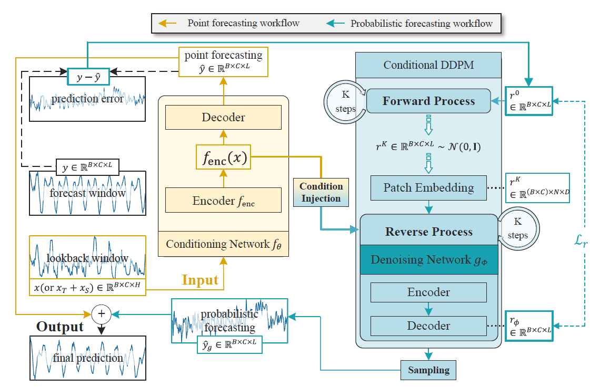

# Diffusion-based-Decoupled-Deterministic-and-Uncertain-Framework-for-Probabilistic-MTS-Forecasting
The repo is the official implementation for the paper: Diffusion-based-Decoupled-Deterministic-and-Uncertain-Framework-for-Probabilistic-MTS-Forecasting. 

We provide support for iTransformer as a point forecasting model in another project (https://github.com/Torea-L/D3U), 
where we will deliver long-term irregular updates for D3U. Thank you for your interest in D3U.


## Overall Architecture

## Usage
Train and evaluate the model. We provide all the above tasks under the folder ./scripts/. You can reproduce the results as the following examples:
<div style="position: relative;">
  <pre>
    <code id="codeBlock">
# D3U Multivariate Probabilistic forecasting where SparseVQ functions as the conditioning network and PatchDN serves as the denoising
network.
bash ./scripts/SVQ/exp_study/
    </code>
  </pre>
  <button style="position: absolute; top: 0; right: 0; padding: 5px; background: #f5f5f5; border: none; cursor: pointer;" onclick="copyCode()">
    📋
  </button>
</div>

## Contact
If you have any questions or want to use the code, feel free to contact:

- ​**Qi Li**: [li.q@bupt.edu.cn](mailto:li.q@bupt.edu.cn)
- ​**Zhenyu Zhang**: [zhangzhenyucad@bupt.edu.cn](mailto:zhangzhenyucad@bupt.edu.cn)


## Citation
If you find this repo helpful, please cite our paper.

```markdown
@inproceedings{lidiffusion,
  title={Diffusion-based Decoupled Deterministic and Uncertain Framework for Probabilistic Multivariate Time Series Forecasting},
  author={Li, Qi and Zhang, Zhenyu and Yao, Lei and Li, Zhaoxia and Zhong, Tianyi and Zhang, Yong},
  booktitle={The Thirteenth International Conference on Learning Representations}
}

